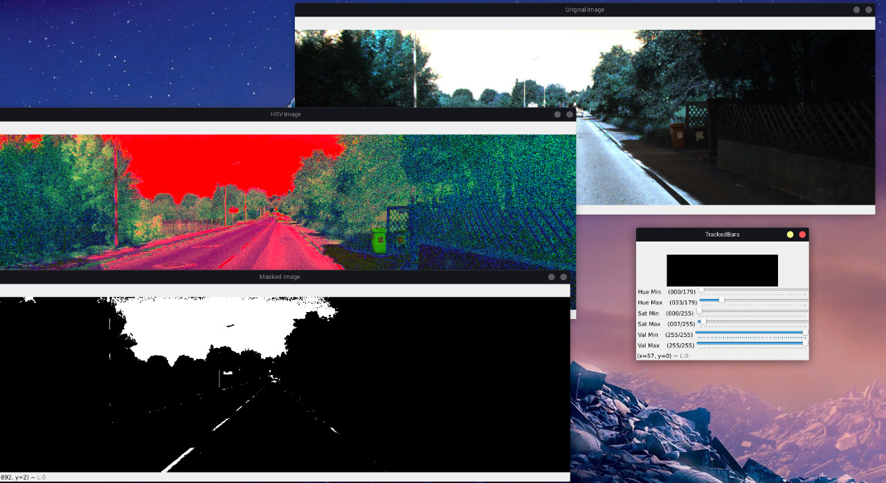

# Final Project Report

## Summary
- [Objective](#objective)
- [Input Images](#input-images)
- [Step by Step](#step-by-step)

## <a id="objective"></a> Objective

The main objective of the project is to design an algorithm that is capable of identifying 
road lanes in a given input image. The program must also find the midpoint of the road 
in order to feed a possible control algorithm for autonomous vehicles.

## <a id="input-images"></a> Input Images

Input images will be road acquired images by real vehicles. 
The dataset chosed by the development team is the 
[KITTI-Road/Lane Detection Evaluation 2013](https://www.kaggle.com/datasets/tryingit/roadlane-detection-evaluation-2013?resource=download). 
It has been created in collaboration with Jannik Fritsch and Tobias Kuehnl from Honda Research Institute Europe GmbH. 
The main reason for that decision is the lane uniformity visually shown in the dataset, helping in the implementation tests. 
Some images can be seen in "dataset_examples" folder in this repository.

Other datasets found:
- [CurveLanes](https://github.com/SoulmateB/CurveLanes)
- [TuSimple](https://github.com/TuSimple/tusimple-benchmark)
- [Robust-Lane-Detection](https://github.com/qinnzou/Robust-Lane-Detection/blob/master/README.md)
- [CULane](https://xingangpan.github.io/projects/CULane.html)


## <a id="step-by-step"></a> Step by Step and Methods

In order to achieve what has been proposed, the group developed a deterministic algorithm using OpenCV and SKLearn libraries
that can be split into separate models: Mask creation, image pre-processing, edge detection, lane detection and middle lane
detection. Each one of these models will be explained in detail below.

### Mask Creation

The mask creation algorithm was created to easily allow the user to input initial conditions to the algorithm. As it's
deterministic, it can be quite hard to find out what is defined as a lane and what isn't in different conditions of track conditions,
illumination, etc.

The idea is that the user can input a starting mask to the algorithm and this fixed mask will apply to all following frames.
The mask is nothing more than an array of values that specify minimum and maximum HSV values that define a certain lane.



The array of masks is stored in ```mask.json``` and is referenced during image processing.

### Image Pre-Processing

The frame caught by the camera cannot be considered ready to be processed as it contains a lot
of noise and "useless" information to the problem. In order to better suit the detection algorithm, a series
of transformations is applied to the input image.

First, the image is cropped to only its bottom half, as it's supposed that the camera is vertically aligned with
the horizontal line of the image (witch implies that everything above the center corresponds to thigs other than road).

Then, the image is transformed to HSV spectrum in order to be filtered, as it simplifies and better suits filtering process.
A threshold algorithm is then applied to only show parts of the image that fall between specified range.

The binary image than recieves a gaussian blur and a closing transformation.

<b> IMAGES </b>

### Edge Detection

In order to detect the edges of the image, a canny edge detection algorithm is then applied. To make sure all edges are
closed a closing algorithm is applied again. The edged image is passed to a contour creation algorithm from OpenCV, witch
transforms the pixels into a list of points, corresponding to the contours.

Said contours are then filtered by size (small contours are assumed to be noise) and forced to be convex to be easily
identified and processed.

<b> IMAGES </b>

### Lane Detection

As for the lane detection algorithm, it recieves the list of contours captured and applies a KMeans method to
find the correspondence between the contours and the proper lane.

<b> IMAGES </b>

### Middle Lane Detection


## Results


## Group Members Roles

- Lucas Toschi de Oliveira
    * Lane detection algorithm implementation
    * Contour detection implementation
- Murilo Fantucci Todão
    * Image processing implementation
    * Seeding and masking implementation
    * Notebook transcription
- Rafael Takano
    * Presentation slides
    * Notebook transcription
- Thiago Vicentini
    * Image filtering implementation
    * Implementation of helper functions
